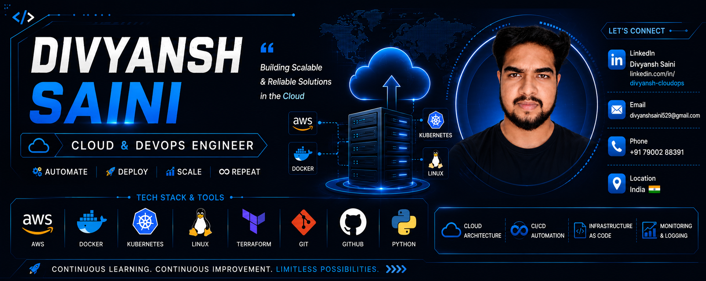

<p align="center">
  
</p>

<h1 align="center">Hi 👋, I'm Divyansh Saini</h1>

<h3 align="center">
Cloud & DevOps Engineer • AWS • Docker • Kubernetes • Terraform
</h3>

<p align="center">

</p>

---

# 🚀 About Me

```yaml
Name: Divyansh Saini

Role: Cloud & DevOps Engineer

Location: India

Learning:
  - AWS
  - Docker
  - Kubernetes
  - Terraform

Goal:
  Become a Professional Cloud & DevOps Engineer
```

---

# ☁ Cloud Platform

<p align="center">


</p>

---

# ☁ AWS Services

| Compute | Storage | Monitoring | Security |
|---------|----------|------------|------------|
| EC2 | S3 | CloudWatch | IAM |
| ECS | EBS | CloudTrail | AWS Config |
| Elastic Beanstalk | | | |

---

# ⚙ DevOps Stack

<p align="center">


</p>

---

# 💻 Programming & OS

<p align="center">


</p>

---

# 🌿 Version Control

<p align="center">


</p>

---

# 🛠 Skills Summary

```text
☁ Cloud
AWS

☁ AWS Services
EC2
ECS
EBS
S3
IAM
CloudWatch
CloudTrail
AWS Config
Elastic Beanstalk

⚙ DevOps
Docker
Kubernetes
Terraform
Jenkins

💻 Programming
Python
Bash

🐧 Operating System
Linux

🌿 Version Control
Git
GitHub
```

---

 
---

# 🔥 Contribution Streak

<p align="center">


</p>

---

# 📌 Featured Projects

| Project | Description |
|----------|-------------|
| ☁ AWS EC2 Web Server | Apache Web Server on EC2 |
| 🐳 Docker Projects | Docker Hands-on Labs |
| ☸ Kubernetes Labs | Pods, Deployments & Services |
| 🌍 Terraform | Infrastructure as Code |
| ⚙ Jenkins | CI/CD Pipelines |
| 🐧 Linux | Linux Commands & Administration |
| 🐍 Python | Automation Scripts |

---

# 📚 Currently Learning

- AWS ECS
- Kubernetes
- Terraform
- Jenkins
- Docker Compose
- Linux Shell Scripting
- GitHub Actions

---

 
# 🌐 Connect With Me

<p align="left">

<a href="https://www.linkedin.com/in/divyanshsaini14/">


</a>

<a href="divyanshsaini327@gmail.com">


</a>

</p>

---

<p align="center">

⭐ If you like my work, don't forget to star my repositories ⭐

</p>
